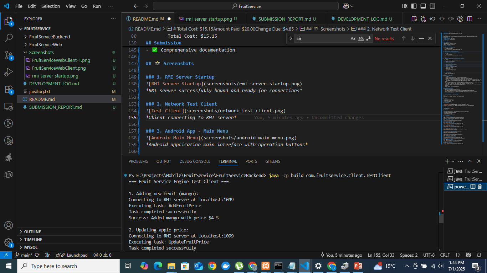
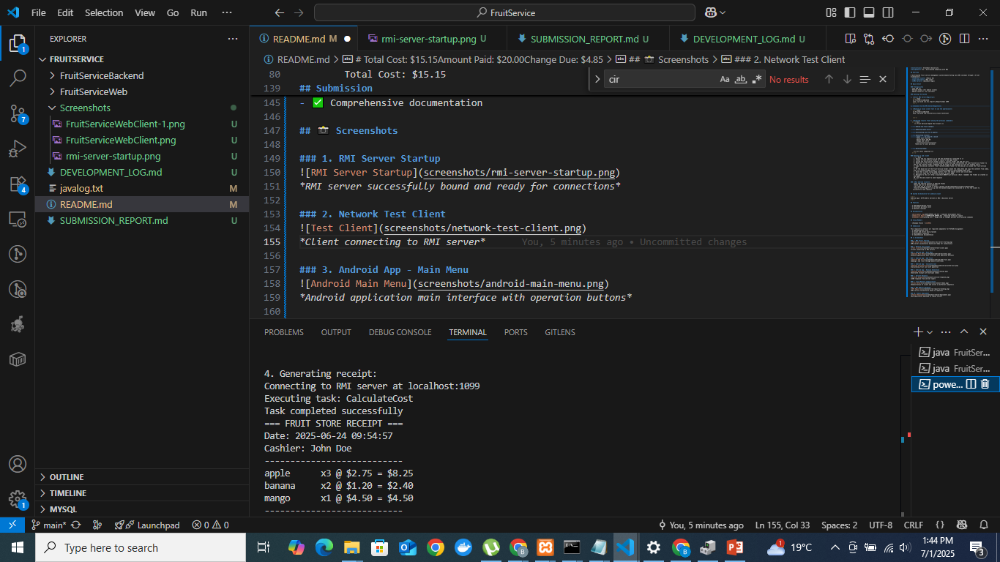
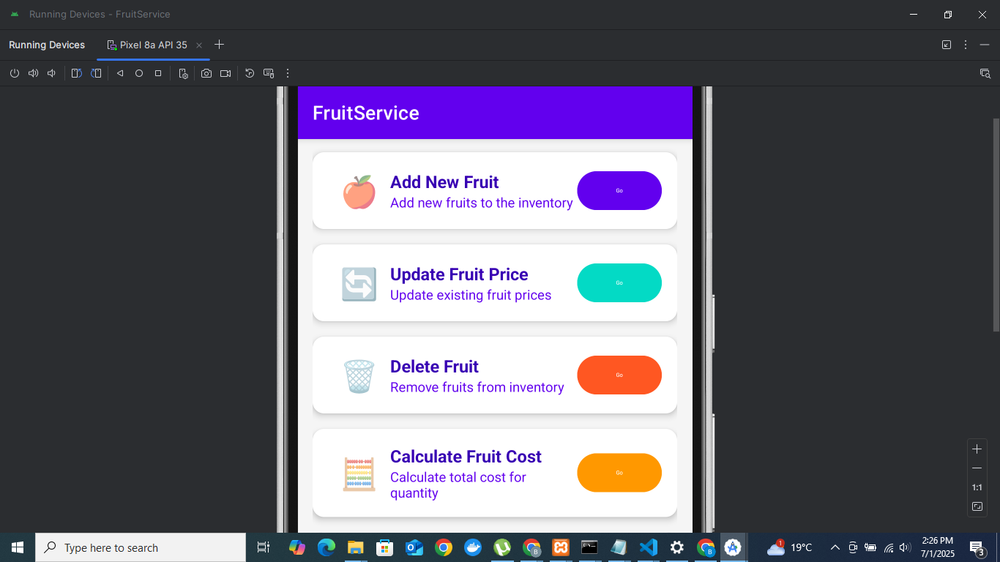
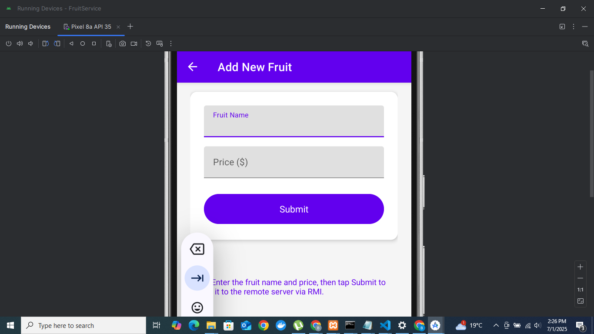
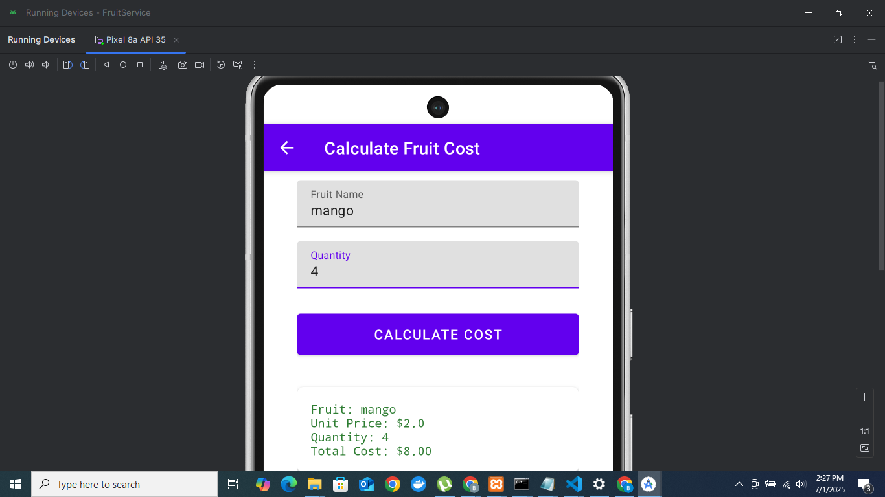
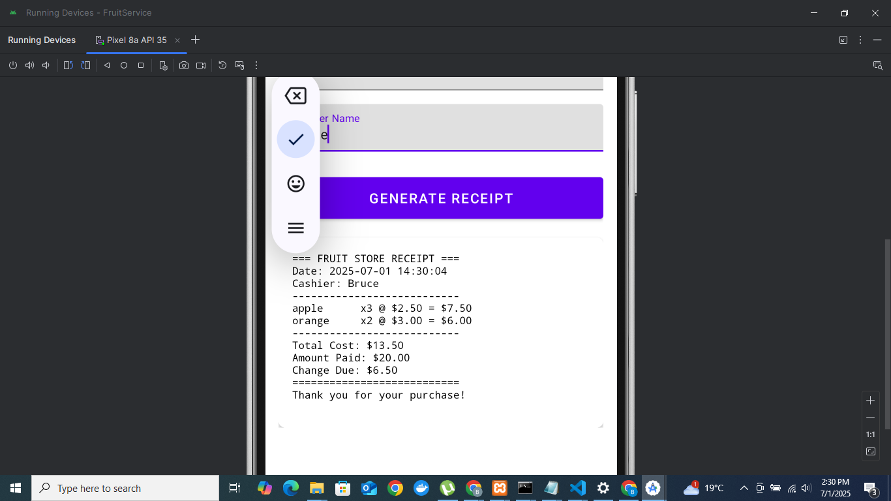
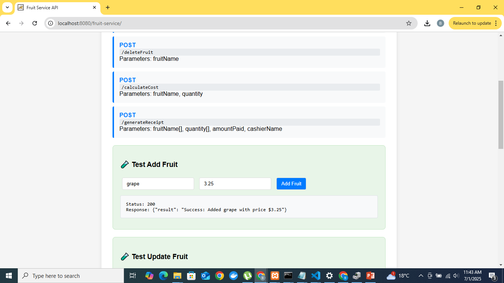
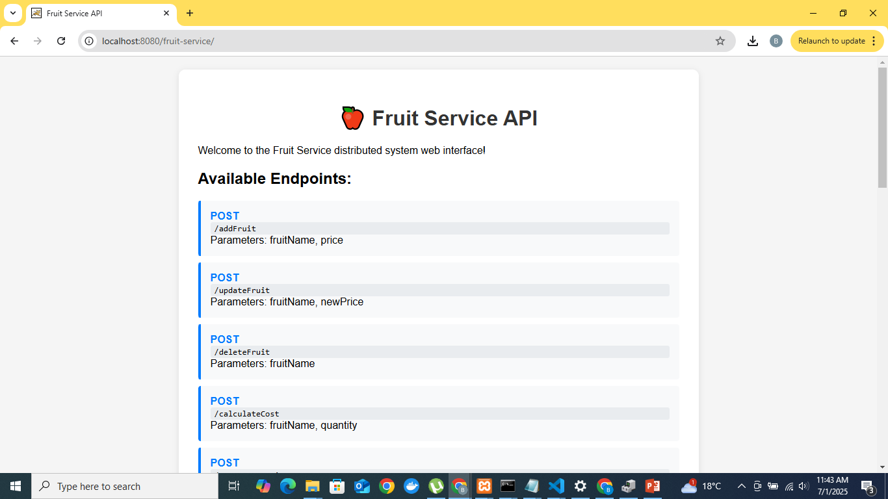
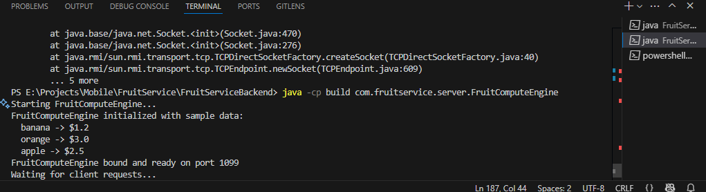
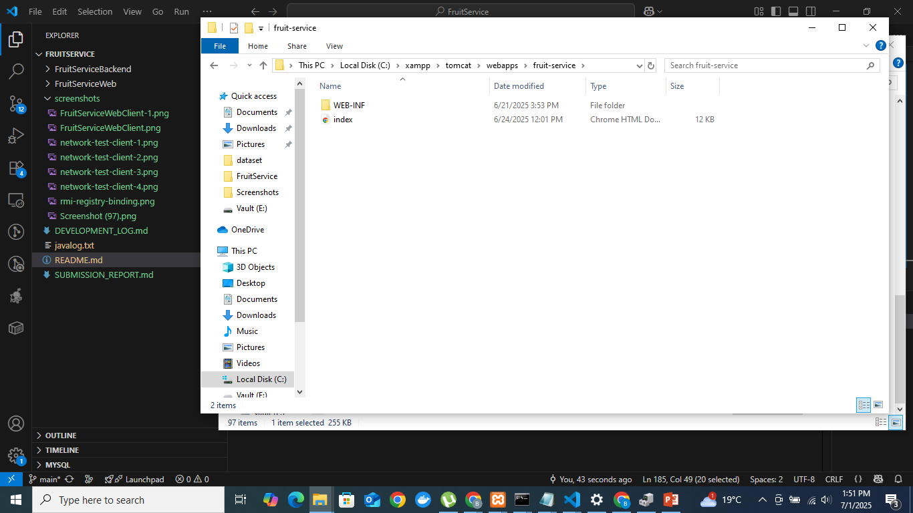

# Fruit Service RMI Application

**Course**: MIT8102 Advanced Distributed Systems  
**Institution**: Strathmore University  
**Assignment**: #1 - Distributed Computing with RMI

## Overview

A distributed fruit service management system demonstrating Java RMI concepts through a 3-tier architecture:
- **Android Client** (Mobile UI)
- **Java Servlets** (Web Layer) 
- **RMI Server** (Business Logic)

## Quick Start

### Prerequisites
- Java JDK 11+
- Android Studio (for mobile client)
- Apache Tomcat 9+ (for servlets)

### Running the System 

1. **Start RMI Server/Registry**:
   ```bash
   cd FruitServiceBackend
   java -cp build sun.rmi.registry.RegistryImpl 1099
   ```

2. **Connect to the RMI Server/Registry**:
   \`\`\`bash
   cd FruitServiceBackend
   java -cp build com.fruitservice.server.FruitComputeEngine
   \`\`\`

3. **Running a local client test to see the operations**:
   ```bash
   cd FruitServiceBackend
   java -cp build com.fruitservice.client.TestClient

  
   ```

4. **Expected results from running the previous command**:
  ```bash
     === Fruit Service Engine Test Client ===

    1. Adding new fruit (mango):
    Connecting to RMI server at localhost:1099
    Executing task: AddFruitPrice
    Task completed successfully
    Success: Added mango with price $4.5

    2. Updating apple price:
    Connecting to RMI server at localhost:1099
    Executing task: UpdateFruitPrice
    Task completed successfully
    Success: Updated apple price from $2.5 to $2.75

    3. Calculating cost for 5 apples:
    Connecting to RMI server at localhost:1099
    Executing task: CalFruitCost
    Task completed successfully
    Fruit: apple
    Unit Price: $2.75
    Quantity: 5
    Total Cost: $13.75

    4. Generating receipt:
        Connecting to RMI server at localhost:1099
        Executing task: CalculateCost
        Task completed successfully
        === FRUIT STORE RECEIPT ===
        Date: 2025-06-24 09:54:57
        Cashier: John Doe
        ---------------------------
        apple      x3 @ $2.75 = $8.25
        banana     x2 @ $1.20 = $2.40
        mango      x1 @ $4.50 = $4.50
        ---------------------------
        Total Cost: $15.15
        Amount Paid: $20.00
        Change Due: $4.85
        ===========================
      Thank you for your purchase!


    5. Deleting mango:
    Connecting to RMI server at localhost:1099
    Executing task: DeleteFruitPrice
    Task completed successfully
    Success: Deleted mango (was $4.5)

    === All tests completed ===
  ```

### Running on web client
    ```bash
    1. Ensure the rmi registry is up and the backend has connected to it
    2. Create a fruit-service folder in tomcat's web apps folder
    3. Inside the fruit-service folder create a classes folder and web.xml file
    4. Head over to the fruit service backend folder and copy iteratively the com/fruitservice folder to  the to the classes folder (commands can be found in the javalog.txt file for windows users)
    5. Copy the web.xml contents from FruitServiceWeb folder to the web.xml in inside the fruit-service folder
    6. At the base/root of the fruit-service folder create the index.html and copy the contents from index.html in FruitServiceWeb folder i.e FruitServiceWeb/src/main/webapp/index.html
    7. Once that is done using xammp control start the tomcat server and click admin
    8. This will take you to localhost browser on port 8080
    9. Navigate to this url http://localhost:8080/fruit-service/ (Hint: remember the folder we created in web apps)
    10. Use the web client to send requests 
    ```

### **Run Android Client**:
   - Open the android project in Android Studio
   - Build and run on device/emulator
   - the repo may be located in https://github.com/BruceOnyango/FruitServiceAndroidApp
   - Ensure the RMIregistry is up and the backend engine has connected to it for the client to successfully send requests


## System Architecture for android client

```bash
Android App → HTTP/JSON → Servlets → RMI → Business Server
```

## Features

- ✅ Add/Update/Delete fruits
- ✅ Calculate purchase costs
- ✅ Generate receipts

## Documentation

- [Development Log](DEVELOPMENT_LOG.md) - Complete development diary
- [Submission Report](SUBMISSION_REPORT.md) - Detailed technical report
- [Commands used](javalog.txt) - Rough view of thought process with detailed commands

## Group Members

- [Onyango Bruce] - [121063]

## Submission

This repository contains all required components for MIT8102 Assignment:
- ✅ Implementation files
- ✅ Client and server main programs  
- ✅ Development log/diary
- ✅ Comprehensive documentation

## 📸 Screenshots

### 1. RMI Server Startup
.png)
*RMI server successfully bound and ready for connections*

### 2. Network Test Client




*Client connecting to RMI server*

### 3. Android App - Main Menu

*Android application main interface with operation buttons*

### 4. Android App - Add Fruit

*Adding a new fruit through mobile interface*

### 5. Android App - Calculate Cost

*Calculating fruit cost with quantity*

### 6. Android App - Receipt Generation

*Generated receipt with multiple items*

### 7. Servlet Response

*JSON response from servlet layer*

### 8. WebClient

*view of web client*

### 9. RMI Registry Binding

*RMI service successfully bound to registry*

### 10. Tomcat Deployment

*Web application deployed to Tomcat server*
